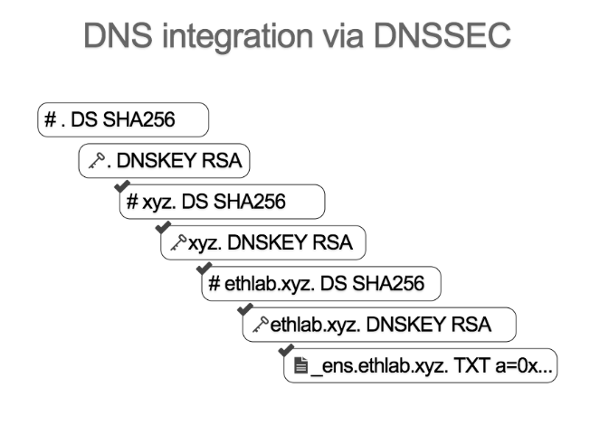

*******************
Under the hood
*******************

============
How it works
============

DNSSEC (The Domain Name System Security Extensions) establishes a chain of trust from the root key which signed by ICANN (.) and down through each key. We start off knowing the hash of the root key of DNS (this is hard coded in the smart contract oracle).
Given the hashes of that key, we can pass in the actual key, we can verify that it matches the hash and we can add it to the set of the trusted records.

Given that key, we can now verify any record that is signed with that key, so in this case, it's the hash of the root of the xyz top level domain.
Given that, we can recognize the key, and so on and so forth.

So next, you can regonize the key for the ethlab.xyz.
Given that, we can recognize the hash for the key, and then key itself,and finally you can verify a signed text record that contains the Ethereum address.

====================
Constructing a proof
====================

To construct a proof to submit to Oracle smart contract, you first need to provide name, rrsig, and rrset.

:name: name of the dns record

.. code-block:: javascript

    let name = '.'

:rrsig: Resource record digital signature

.. code-block:: javascript

    let sig = { name: '.',
        type: 'RRSIG',
        ttl: 0,
        class: 'IN',
        flush: false,
        data:
        { typeCovered: 'DNSKEY',
            algorithm: 253,
            labels: 0,
            originalTTL: 3600,
            expiration: 2528174800,
            inception: 1526834834,
            keyTag: 5647,
            signersName: '.',
            signature: new Buffer([]) }
        }

:rrset: DNS resource record sets

.. code-block:: javascript

    let rrs = [
            {
                name: '.',
                type: 'DNSKEY',
                ttl: 3600,
                class: 'IN',
                flush: false,
                data: { flags: 257, algorithm: 253, key: Buffer.from("1111", "HEX")}
            },
            {
                name: '.',
                type: 'DNSKEY',
                ttl: 3600,
                class: 'IN',
                flush: false,
                data: { flags: 257, algorithm: 253, key: Buffer.from("1111", "HEX")}
            },
            {
                name: '.',
                type: 'DNSKEY',
                ttl: 3600,
                class: 'IN',
                flush: false,
                data: { flags: 257, algorithm: 253, key: Buffer.from("1112", "HEX")}
            }
        ]

Once the data is constructed, Instantiate `Result` object with the data which builds the proofs. `toSubmit` will generate the input data.

.. code-block:: javascript

        const Result = require('@ensdomains/dnsprovejs/dist/dns/result')
        let result = new Result([{name,sig,rrs}])
        result.proofs[0].toSubmit()
        // [ '0x0030fd0000000e1096b0e2d05b01a692160f00000030000100000e100006010103fd1111000030000100000e100006010103fd1111000030000100000e100006010103fd1112',
  '0x' ]
